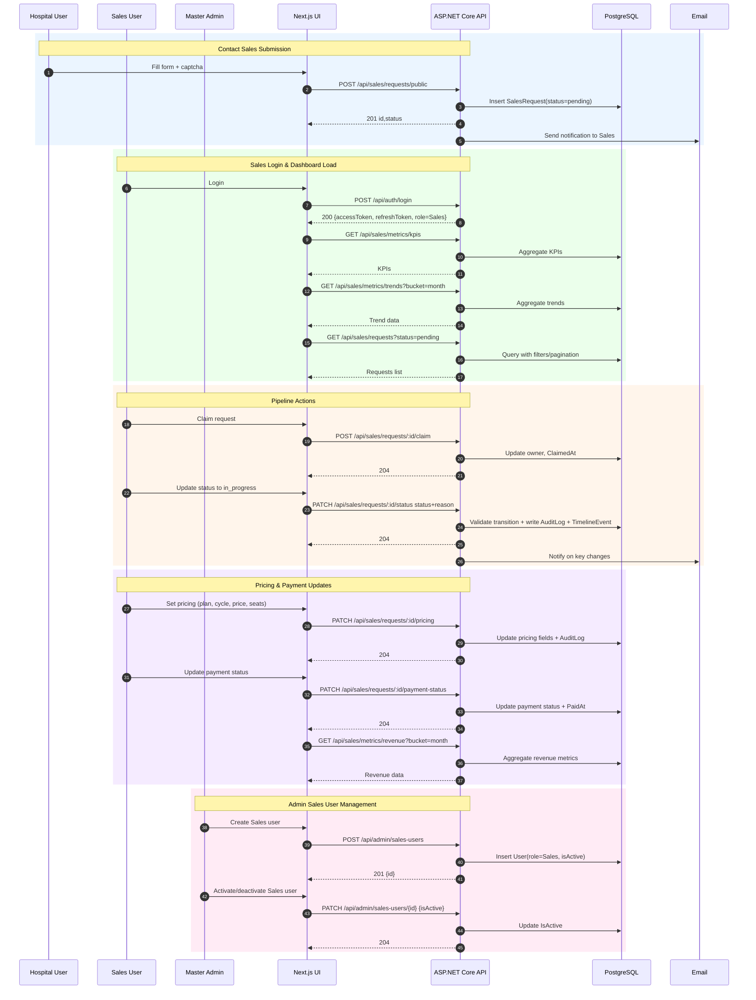

```mermaid
sequenceDiagram
  autonumber
  participant H as Hospital User
  participant S as Sales User
  participant M as Master Admin
  participant UI as Next.js UI
  participant API as ASP.NET Core API
  participant DB as PostgreSQL
  participant SMTP as Email

  rect rgb(235, 245, 255)
  note over H,API: Contact Sales Submission
  H->>UI: Fill form + captcha
  UI->>API: POST /api/sales/requests/public
  API->>DB: Insert SalesRequest(status=pending)
  API-->>UI: 201 id,status
  API->>SMTP: Send notification to Sales
  end

  rect rgb(235, 255, 235)
  note over S,API: Sales Login & Dashboard Load
  S->>UI: Login
  UI->>API: POST /api/auth/login
  API-->>UI: 200 {accessToken, refreshToken, role=Sales}
  UI->>API: GET /api/sales/metrics/kpis
  API->>DB: Aggregate KPIs
  API-->>UI: KPIs
  UI->>API: GET /api/sales/metrics/trends?bucket=month
  API->>DB: Aggregate trends
  API-->>UI: Trend data
  UI->>API: GET /api/sales/requests?status=pending
  API->>DB: Query with filters/pagination
  API-->>UI: Requests list
  end

  rect rgb(255, 245, 235)
  note over S,API: Pipeline Actions
  S->>UI: Claim request
  UI->>API: POST /api/sales/requests/:id/claim
  API->>DB: Update owner, ClaimedAt
  API-->>UI: 204
  S->>UI: Update status to in_progress
  UI->>API: PATCH /api/sales/requests/:id/status status+reason
  API->>DB: Validate transition + write AuditLog + TimelineEvent
  API-->>UI: 204
  API->>SMTP: Notify on key changes
  end

  rect rgb(245, 235, 255)
  note over S,API: Pricing & Payment Updates
  S->>UI: Set pricing (plan, cycle, price, seats)
  UI->>API: PATCH /api/sales/requests/:id/pricing
  API->>DB: Update pricing fields + AuditLog
  API-->>UI: 204
  S->>UI: Update payment status
  UI->>API: PATCH /api/sales/requests/:id/payment-status
  API->>DB: Update payment status + PaidAt
  API-->>UI: 204
  UI->>API: GET /api/sales/metrics/revenue?bucket=month
  API->>DB: Aggregate revenue metrics
  API-->>UI: Revenue data
  end

  rect rgb(255, 235, 245)
  note over M,API: Admin Sales User Management
  M->>UI: Create Sales user
  UI->>API: POST /api/admin/sales-users
  API->>DB: Insert User(role=Sales, isActive)
  API-->>UI: 201 {id}
  M->>UI: Activate/deactivate Sales user
  UI->>API: PATCH /api/admin/sales-users/{id} {isActive}
  API->>DB: Update IsActive
  API-->>UI: 204
  end
```
