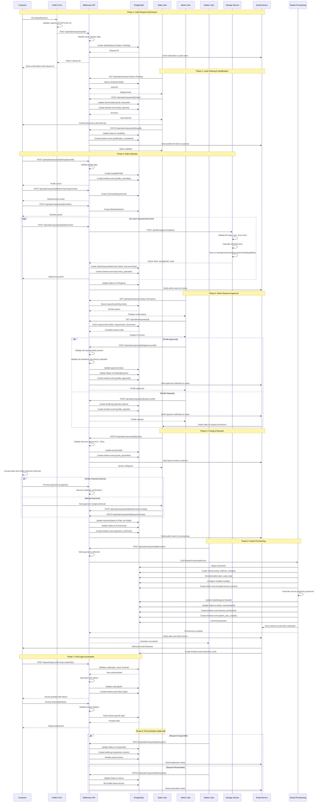

# Hospital Onboarding Process - Sequence Diagram

```mermaid
sequenceDiagram
    participant C as Customer
    participant PF as Public Form
    participant API as Mediconyx API
    participant DB as PostgreSQL
    participant S as Sales User
    participant A as Admin User
    participant M as Master User
    participant ST as Storage Service
    participant ES as Email Service
    participant TP as Tenant Provisioning

    Note over C,ES: Phase 1: Initial Request Submission
    C->>PF: Fill onboarding form
    PF->>PF: Validate captcha (reCAPTCHA v3)
    PF->>API: POST /api/sales/requests/public
    API->>API: Validate input, sanitize data
    API->>DB: Create SalesRequest (Status: Pending)
    DB-->>API: Request ID
    API->>ES: Send notification to sales team
    API-->>PF: Return request ID
    PF-->>C: Show confirmation with request ID

    Note over S,ES: Phase 2: Lead Claiming & Qualification
    S->>API: GET /api/sales/requests?status=Pending
    API->>DB: Query unclaimed leads
    DB-->>API: Lead list
    API-->>S: Display leads
    S->>API: POST /api/sales/requests/{id}/claim
    API->>DB: Update OwnerSalesUserId, ClaimedAt
    API->>DB: Create timeline event (lead_claimed)
    DB-->>API: Success
    API-->>S: Lead claimed

    S->>C: Conduct discovery call (external)
    S->>API: PATCH /api/sales/requests/{id}/qualify
    API->>DB: Update Status to Qualified
    API->>DB: Create timeline event (qualification_completed)
    API->>ES: Send profile form link to customer
    API-->>S: Status updated

    Note over C,ST: Phase 3: Data Collection
    C->>API: POST /api/sales/requests/{id}/hospital-profile
    API->>API: Validate profile data
    API->>DB: Create HospitalProfile
    API->>DB: Create timeline event (profile_submitted)
    API-->>C: Profile saved

    C->>API: POST /api/sales/requests/{id}/technical-requirements
    API->>DB: Create TechnicalRequirements
    API-->>C: Requirements saved

    C->>API: POST /api/sales/requests/{id}/modules
    API->>DB: Create ModuleSelection
    API-->>C: Modules saved

    loop For each required document
        C->>API: POST /api/sales/requests/{id}/attachments
        API->>ST: POST /api/files/upload (multipart)
        ST->>ST: Validate file (type, size, virus scan)
        ST->>ST: Calculate SHA256 hash
        ST->>ST: Save to /storage/onboarding/{year}/{month}/{day}/{fileId}
        ST-->>API: Return fileId, storagePath, hash
        API->>DB: Create SalesRequestAttachment (fileId, documentType)
        API->>DB: Create timeline event (document_uploaded)
        API-->>C: Upload successful
    end

    API->>DB: Update Status to InProgress
    API->>ES: Notify admin team for review
    
    Note over A,ES: Phase 4: Admin Review & Approval
    A->>API: GET /api/sales/requests?status=InProgress
    API->>DB: Query requests pending review
    DB-->>API: Review queue
    API-->>A: Display review queue

    A->>API: GET /api/sales/requests/{id}
    API->>DB: Fetch request with profile, requirements, documents
    DB-->>API: Complete request data
    API-->>A: Display for review

    alt Profile Approved
        A->>API: POST /api/sales/requests/{id}/approve-profile
        API->>API: Validate all required fields present
        API->>API: Validate all mandatory documents uploaded
        API->>DB: Update approval status
        API->>DB: Update Status to AwaitingPayment
        API->>DB: Create timeline event (profile_approved)
        API->>ES: Send approval notification to sales
        API-->>A: Profile approved
    else Profile Rejected
        A->>API: POST /api/sales/requests/{id}/reject-profile
        API->>DB: Create AuditLog (rejection reason)
        API->>DB: Create timeline event (profile_rejected)
        API->>ES: Send rejection notification to sales
        API-->>A: Profile rejected
        ES->>S: Notify sales to request corrections
    end

    Note over S,ES: Phase 5: Pricing & Payment
    S->>API: PATCH /api/sales/requests/{id}/pricing
    API->>API: Validate discount approval (if > 10%)
    API->>DB: Update pricing fields
    API->>DB: Create timeline event (quote_generated)
    API->>ES: Send quote email to customer
    API-->>S: Quote configured

    C->>C: Accept quote and initiate payment (external)
    
    alt Online Payment (future)
        C->>API: Process payment via gateway
        API->>API: Receive webhook confirmation
    else Manual Payment
        C->>S: Send payment receipt (external)
        S->>API: POST /api/sales/requests/{id}/attachments (receipt)
        S->>API: PATCH /api/sales/requests/{id}/payment-status
    end

    API->>DB: Update PaymentStatus to Paid, set PaidAt
    API->>DB: Update Status to Provisioning
    API->>DB: Create timeline event (payment_confirmed)
    API->>ES: Notify admin team for provisioning

    Note over M,TP: Phase 6: Tenant Provisioning
    M->>API: POST /api/sales/requests/{id}/provision
    API->>API: Verify payment confirmed
    API->>TP: Call TenantProvisioningService
    
    TP->>DB: Begin transaction
    TP->>DB: Create Tenant (name, address, contacts)
    TP->>DB: Set subscription plan, expiry date
    TP->>DB: Configure enabled modules
    TP->>DB: Create Admin User (hospital primary contact)
    TP->>TP: Generate secure temporary password
    TP->>DB: Update SalesRequest.TenantId
    TP->>DB: Update Status to Active, set ActivatedAt
    TP->>DB: Create timeline event (tenant_provisioned)
    TP->>DB: Create timeline event (admin_user_created)
    TP->>DB: Commit transaction
    
    TP->>ES: Send welcome email with credentials
    TP-->>API: Provisioning complete
    API->>ES: Notify sales and admin teams
    API-->>M: Activation successful

    ES->>C: Welcome email delivered
    ES->>DB: Create timeline event (welcome_sent)

    Note over C,DB: Phase 7: First Login & Activation
    C->>API: POST /api/auth/login (with temp credentials)
    API->>DB: Validate credentials, check TenantId
    DB-->>API: User authenticated
    API->>API: Generate JWT tokens
    API->>DB: Update LastLoginAt
    API->>DB: Create timeline event (first_login)
    API-->>C: Access granted with tokens

    C->>API: Access tenant dashboard
    API->>API: Validate tenant isolation
    API->>DB: Fetch tenant-specific data
    DB-->>API: Hospital data
    API-->>C: Display dashboard

    Note over S,DB: Phase 8: Post-Activation (Optional)
    alt Request Suspended
        M->>API: PATCH /api/sales/requests/{id}/suspend
        API->>DB: Update Status to Suspended
        API->>DB: Create AuditLog (suspension reason)
        API->>DB: Disable tenant access
        API->>ES: Send suspension notice
    else Request Reactivated
        M->>API: PATCH /api/sales/requests/{id}/reactivate
        API->>DB: Update Status to Active
        API->>DB: Re-enable tenant access
        API->>ES: Send reactivation notice
    end
```
